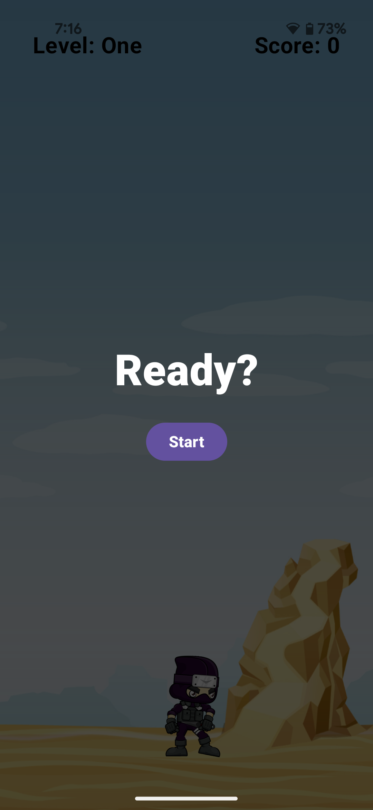
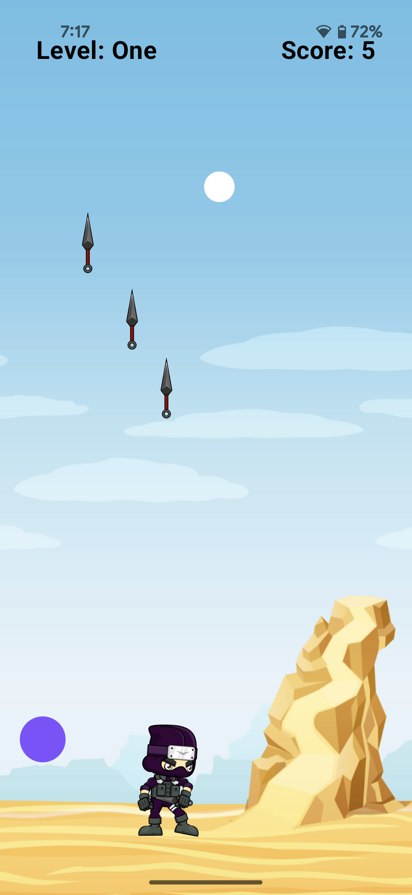

# AndKmp-NinjaGame
KMPで作成した忍者ゲーム Anaroid(Pixle 4a)で動作確認

KMPの勉強のために[Abhishek Roushan](https://github.com/Abhi95081/NinjaBubble.git)さんのを流用

Gradleバージョン/AGPバージョン違いで読込エラーが発生することが多い中、このプロジェクトはAndroid Studioに読込んでビルドすると動作した貴重なサンプル。

 
